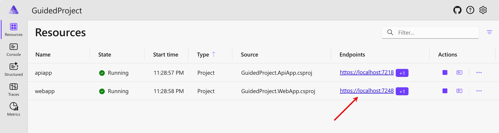
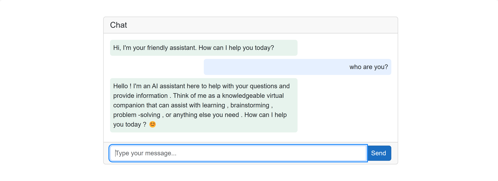
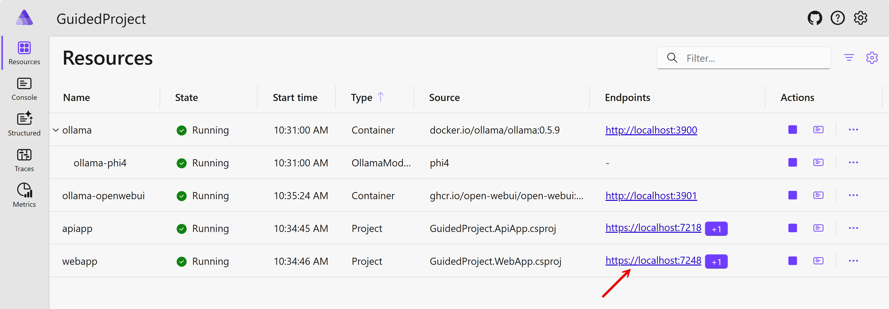
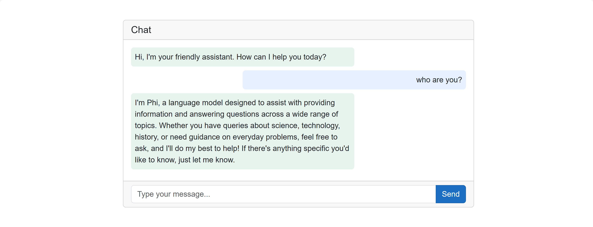

# EP10: 가이드 프로젝트 1

Semantic Kernel을 활용한 지능형 앱 개발하기 첫번째 가이드 프로젝트입니다.

- ✅ Blazor 프론트엔드
- ✅ Semantic Kernel 백엔드
- ✅ Azure OpenAI를 활용한 챗봇 구현하기
- ✅ 로컬 환경에서 돌아가는 챗봇 구현하기

- 🎙️ 진행: 유저스틴
- 📜 자료: https://aka.ms/g3jlearnsk

#g3jlearnsk #semantickernel #ai #intelligentapps

## 시작하기

- 시작 프로젝트: `ep10/start`
- 완성 프로젝트: `ep10/complete`

### 리포지토리 루트 구하기

`REPOSITORY_ROOT` 변수를 선언합니다.

```bash
# bazh/zsh
REPOSITORY_ROOT=$(git rev-parse --show-toplevel)
```

```powershell
# PowerShell
$REPOSITORY_ROOT = git rev-parse --show-toplevel
```

### 시작 프로젝트 이동

1. 시작 프로젝트로 이동합니다.

    ```bash
    cd $REPOSITORY_ROOT/ep10/start
    ```

### GitHub Models 사용하기

우선 GitHub Models에서 제공하는 GPT-4o 모델을 `OpenAIClient`를 이용해서 연결해 보겠습니다.

#### AppHost 프로젝트 수정

1. GitHub에서 Personal Access Token(PAT) 값을 생성합니다.
1. 아래와 같이 GitHub Models에 접속하기 위한 커넥션 스트링을 생성합니다. `{{GITHUB_TOKEN}}`은 앞서 생성한 PAT입니다.

    ```bash
    dotnet user-secrets --project ./GuidedProject.AppHost set "ConnectionStrings:openai" "Endpoint=https://models.inference.ai.azure.com;Key={{GITHUB_TOKEN}}"
    ```

1. [GitHub Models](https://github.com/marketplace?type=models)에서 제공하는 Inference API를 사용하기 위해 아래와 같이 NuGet 패키지를 추가합니다.

    ```bash
    dotnet add ./GuidedProject.AppHost package Aspire.Hosting.Azure.CognitiveServices
    ```

1. `GuidedProject.AppHost/Program.cs` 파일을 열어 `OpenAIClient` 레퍼런스를 추가합니다.

    ```csharp
    var builder = DistributedApplication.CreateBuilder(args);

    // 👇👇👇 OpenAI 인스턴스 추가
    var openai = builder.AddConnectionString("openai");
    ```

1. 같은 파일에서 `apiapp` 인스턴스에 앞서 생성한 `OpenAIClient` 레퍼런스를 추가합니다. 더불어 환경변수값도 추가합니다.

    ```csharp
    var openai = builder.AddConnectionString("openai");

    // 👇👇👇 API app에 OpenAI 인스턴스 레퍼런스 추가
    var config = builder.Configuration;

    var apiapp = builder.AddProject<GuidedProject_ApiApp>("apiapp")
                        .WithReference(openai)
                        .WithEnvironment("SemanticKernel__ServiceId", config["SemanticKernel:ServiceId"]!)
                        .WithEnvironment("GitHub__Models__ModelId", config["GitHub:Models:ModelId"]!);
    ```

#### ApiApp 프로젝트 수정

1. AppHost에서 추가한 OpenAI 인스턴스를 활용하기 위해 아래와 같이 NuGet 패키지를 추가합니다.

    ```bash
    dotnet add ./GuidedProject.ApiApp package Aspire.Azure.AI.OpenAI --prerelease
    ```

1. `GuidedProject.ApiApp/Program.cs` 파일을 열어 아래와 네임스페이스를 추가합니다.

    ```csharp
    using GuidedProject.ApiApp.Services;
    
    // 👇👇👇 using 구문 추가
    using Microsoft.SemanticKernel;
    using OpenAI;
    ```

1. 같은 파일에서 AppHost 프로젝트에서 생성한 `OpenAIClient` 인스턴스를 받아옵니다.

    ```csharp
    builder.Services.AddScoped<IKernelService, KernelService>();

    // 👇👇👇 OpenAI 인스턴스 추가
    builder.AddAzureOpenAIClient("openai");
    ```

1. 같은 파일에서 앞서 생성한 `OpenAIClient` 인스턴스를 Semantic Kernel 인스턴스에 추가합니다.

    ```csharp
    builder.AddAzureOpenAIClient("openai");

    // 👇👇👇 Semantic Kernel 인스턴스에 OpenAIClient 인스턴스 추가
    builder.Services.AddSingleton<Kernel>(sp =>
    {
        var config = builder.Configuration;

        var openAIClient = sp.GetRequiredService<OpenAIClient>();
        var kernel = Kernel.CreateBuilder()
                           .AddOpenAIChatCompletion(
                               modelId: config["GitHub:Models:ModelId"]!,
                               openAIClient: openAIClient,
                               serviceId: "github")
                           .Build();

        return kernel;
    });
    ```

1. `GuidedProject.ApiApp/Endpoints/ChatCompletionEndpoint.cs` 파일을 열어 `await Task.Delay(1000);` 라인을 삭제합니다.

    ```csharp
    public static async IAsyncEnumerable<PromptResponse> PostChatCompletionAsync([FromBody] PromptRequest req, IKernelService service)
    {
        // 👇👇👇 Task.Delay() 삭제
        await Task.Delay(1000);

        var result = service.CompleteChatStreamingAsync(req.Prompt);

        await foreach (var text in result)
        {
            yield return new PromptResponse(text);
        }
    }
    ```

1. `GuidedProject.ApiApp/Services/KernelService.cs` 파일을 열어 아래와 네임스페이스를 추가합니다.

    ```csharp
    using Microsoft.SemanticKernel;
    // 👆👆👆 using 구문 추가
    
    namespace GuidedProject.ApiApp.Services;
    ```

1. 같은 파일에서 아래와 같이 클래스 생성자 부분을 수정합니다.

    ```csharp
    // 변경 전
    public class KernelService : IKernelService
    
    // 변경 후
    public class KernelService(Kernel kernel, IConfiguration config) : IKernelService
    ```

1. 같은 파일에서 `CompleteChatStreamingAsync(string prompt)` 메소드를 아래와 같이 수정합니다.

    ```csharp
    public async IAsyncEnumerable<string> CompleteChatStreamingAsync(string prompt)
    {
        var settings = new PromptExecutionSettings { ServiceId = config["SemanticKernel:ServiceId"] };
        var arguments = new KernelArguments(settings);
    
        var result = kernel.InvokePromptStreamingAsync(prompt, arguments).ConfigureAwait(false);
    
        await foreach (var text in result)
        {
            yield return text.ToString();
        }
    }
    ```

#### Web App 프로젝트 수정

1. `GuidedProject.WebApp/Components/UI/ChatComponent.razor` 파일을 열어 아래 내용을 수정합니다.

    ```razor
    // 변경 전
    await foreach (var text in response)
    {
        await Task.Delay(20);
    
        assistantChatMessage.Content += $"{text} ";
    
        StateHasChanged();
    }

    // 변경 후
    await foreach (var text in response)
    {
        await Task.Delay(20);
    
        assistantChatMessage.Content += $"{text.Replace("\n", "<br />").Replace("\r", "<br />")}";
    
        StateHasChanged();
    }
    ```

1. 같은 파일에서 아래 내용을 수정합니다.

    ```razor
    // 변경 전
    @if (string.IsNullOrWhiteSpace(message.Content) == true)
    {
        <div class="spinner-border text-success" role="status">
            <span class="visually-hidden">Loading...</span>
        </div>
    }
    else
    {
        @message.Content
    }

    // 변경 후
    @if (string.IsNullOrWhiteSpace(message.Content) == true)
    {
        <div class="spinner-border text-success" role="status">
            <span class="visually-hidden">Loading...</span>
        </div>
    }
    else
    {
        @((MarkupString)message.Content)
    }
    ```

#### 앱 실행

1. 아래 명령어를 실행시켜 .NET Aspire 대시보드 앱을 실행시킵니다.

    ```bash
    dotnet watch run --project ./GuidedProject.AppHost
    ```

1. 대시보드가 보이면 `webapp`의 엔드포인트를 클릭합니다.

   

1. 채팅창에서 아무 프롬프트나 입력합니다. 그리고 아래 그림처럼 답하는 것을 확인합니다.

   

1. 이번에는 아래와 같이 질문을 해 봅니다.

    ```text
    곰탕이 뭐야?
    ```

   이후 아래와 같은 질문을 이어서 해 봅니다.

    ```text
    그거랑 햄버거랑 차이가 뭐야?
    ```

1. 답변을 확인한 후 `CTRL`+`C` 키를 눌러 애플리케이션을 종료합니다.

### 챗 히스토리 추가하기

챗 히스토리를 추가해서 맥락을 이해하게끔 수정해 보겠습니다.

#### ApiApp 프로젝트 수정

1. `GuidedProject.ApiApp/Services/KernelService.cs` 파일을 열어 아래 `using ...` 구문을 추가합니다.

    ```csharp
    using Microsoft.SemanticKernel;

    // 👇👇👇 아래 using 구문을 추가합니다
    using Microsoft.SemanticKernel.ChatCompletion;
    using OpenAI.Chat;
    using ChatMessageContent = Microsoft.SemanticKernel.ChatMessageContent;
    ```

1. 같은 파일에서 인터페이스에 아래 메소드를 추가합니다.

    ```csharp
    public interface IKernelService
    {
        // 👇👇👇 아래 메소드를 추가합니다
        IAsyncEnumerable<string> CompleteChatStreamingAsync(IEnumerable<ChatMessageContent> messages);
    }
    ```

1. 같은 파일에서 클래스에 아래 메소드를 추가합니다.

    ```csharp
    public class KernelService(Kernel kernel, IConfiguration config) : IKernelService
    {
        // 👇👇👇 아래 메소드를 추가합니다
        public async IAsyncEnumerable<string> CompleteChatStreamingAsync(IEnumerable<ChatMessageContent> messages)
        {
            var history = new ChatHistory();
            history.AddRange(messages);

            var service = kernel.GetRequiredService<IChatCompletionService>(config["SemanticKernel:ServiceId"]!);

            var result = service.GetStreamingChatMessageContentsAsync(chatHistory: history, kernel: kernel);
            await foreach (var text in result)
            {
                yield return text.ToString();
            }
        }
    }
    ```

1. `GuidedProject.ApiApp/Models/PromptRequest.cs` 파일을 열어 아래 `record`를 추가합니다.

    ```csharp
    public record PromptRequest(string Prompt);
    
    // 👇👇👇 아래 record를 추가합니다
    public record PromptWithRoleRequest(string Role, string Content);
    ```

1. `GuidedProject.ApiApp/Endpoints/ChatCompletionEndpoint.cs` 파일을 열어 아래 `using ...` 구문을 추가합니다.

    ```csharp
    using Microsoft.AspNetCore.Mvc;

    // 👇👇👇 아래 using 구문을 추가합니다
    using Microsoft.SemanticKernel.ChatCompletion;
    using ChatMessageContent = Microsoft.SemanticKernel.ChatMessageContent;
    ```

1. 같은 파일에서 아래와 같이 엔드포인트를 정의합니다.

    ```csharp
    public static IEndpointRouteBuilder MapChatCompletionEndpoint(this IEndpointRouteBuilder routeBuilder)
    {
        var api = routeBuilder.MapGroup("api/chat");

        ...

        // 👇👇👇 아래 엔드포인트를 정의합니다.
        api.MapPost("complete-with-role", PostChatCompletionWithRoleAsync)
           .Accepts<PromptWithRoleRequest>(contentType: "application/json")
           .Produces<IEnumerable<PromptResponse>>(statusCode: StatusCodes.Status200OK, contentType: "application/json")
           .WithTags("chat")
           .WithName("ChatCompletionWithRole")
           .WithOpenApi();

        return routeBuilder;
    }
    ```

1. 같은 파일에서 아래 엔드포인트를 추가합니다.

    ```csharp
    public static async IAsyncEnumerable<PromptResponse> PostChatCompletionWithRoleAsync([FromBody] IEnumerable<PromptWithRoleRequest> req, IKernelService service)
    {
        var messages = new List<ChatMessageContent>();
        foreach (var msg in req)
        {
            ChatMessageContent message = msg.Role switch
            {
                "User" => new ChatMessageContent(AuthorRole.User, msg.Content),
                "Assistant" => new ChatMessageContent(AuthorRole.Assistant, msg.Content),
                "System" => new ChatMessageContent(AuthorRole.System, msg.Content),
                _ => throw new ArgumentException($"Invalid role: {msg.Role}")
            };
            messages.Add(message);
        }

        var result = service.CompleteChatStreamingAsync(messages);
        await foreach (var text in result)
        {
            yield return new PromptResponse(text);
        }
    }
    ```

#### WebApp 프로젝트 수정

1. `GuidedProject.WebApp/Models/PromptRequest.cs` 파일을 열어 아래 `record`를 추가합니다.

    ```csharp
    // 👇👇👇 아래 record를 추가합니다
    public record PromptWithRoleRequest(string Role, string Content);
    ```

1. `GuidedProject.WebApp/ApiClients/ChatClient.cs` 파일을 열어 인터페이스에 아래 메소드를 추가합니다.

    ```csharp
    public interface IChatClient
    {
        // 👇👇👇 아래 메소드를 추가합니다
        IAsyncEnumerable<string> CompleteChatStreamingWithHistoryAsync(IEnumerable<ChatMessage> messages);
    }
    ```

1. 같은 파일에서 클래스에 아래 메소드를 추가합니다.

    ```csharp
    public class ChatClient(HttpClient http) : IChatClient
    {
        // 👇👇👇 아래 메소드를 추가합니다
        public async IAsyncEnumerable<string> CompleteChatStreamingWithHistoryAsync(IEnumerable<ChatMessage> messages)
        {
            var content = messages.Select(p => new PromptWithRoleRequest(p.Role, p.Content));
            var response = await http.PostAsJsonAsync<IEnumerable<PromptWithRoleRequest>>($"{REQUEST_URI}-with-role", content);
    
            response.EnsureSuccessStatusCode();
    
            var result = response.Content.ReadFromJsonAsAsyncEnumerable<PromptResponse>();
            await foreach (var message in result)
            {
                yield return message!.Content;
            }
        }
    ```

1. `GuidedProject.WebApp/Components/UI/ChatComponent.razor` 파일을 열어 아래 내용을 수정합니다.

    ```razor
    // 변경 전
    var response = Chat.CompleteChatStreamingAsync(userMessage);
    
    // 변경 후
    var response = Chat.CompleteChatStreamingWithHistoryAsync(this.Messages);
    ```

#### 앱 실행

1. 아래 명령어를 실행시켜 .NET Aspire 대시보드 앱을 실행시킵니다.

    ```bash
    dotnet watch run --project ./GuidedProject.AppHost
    ```

1. 대시보드가 보이면 `webapp`의 엔드포인트를 클릭합니다.

   

1. 채팅창에서 아래와 같이 질문을 해 봅니다.

    ```text
    곰탕이 뭐야?
    ```

   이후 아래와 같은 질문을 이어서 해 봅니다.

    ```text
    그거랑 햄버거랑 차이가 뭐야?
    ```

1. 답변을 확인한 후 `CTRL`+`C` 키를 눌러 애플리케이션을 종료합니다.

### 컨테이너를 통한 로컬 LLM 사용하기

로컬 네트워크에서도 작동할 수 있도록 컨테이너를 이용해 로컬 LLM을 연결하고 실행시켜 보겠습니다.

#### AppHost 프로젝트 수정

1. [Ollama](https://ollama.com/)에서 제공하는 LLM을 사용하기 위해 아래와 같이 NuGet 패키지를 추가합니다.

    ```bash
    dotnet add ./GuidedProject.AppHost package CommunityToolkit.Aspire.Hosting.Ollama
    ```

1. `GuidedProject.AppHost/Program.cs` 파일을 열어 `OllamaApiClient` 레퍼런스를 추가합니다. 여기서는 `Phi-4` 모델을 사용하겠습니다.

    ```csharp
    var openai = builder.AddConnectionString("openai");

    // 👇👇👇 OpenAI 인스턴스 추가
    var ollama = builder.AddOllama("ollama")
                        .WithDataVolume()
                        .WithOpenWebUI()
                        .AddModel("phi4");
    ```

1. 같은 파일에서 `apiapp` 인스턴스에 앞서 생성한 `OllamaApiClient` 레퍼런스를 추가합니다. 더불어 환경변수값도 추가합니다.

    ```csharp
    var apiapp = builder.AddProject<GuidedProject_ApiApp>("apiapp")
                        .WithReference(openai)
                        .WithReference(ollama)
                        .WithEnvironment("SemanticKernel__ServiceId", config["SemanticKernel:ServiceId"]!)
                        .WithEnvironment("GitHub__Models__ModelId", config["GitHub:Models:ModelId"]!)
                        .WaitFor(ollama);
    ```

1. `GuidedProject.AppHost/appsettings.json` 파일을 열어 `ServiceId` 값을 `ollama`로 수정합니다.

    ```json
    "SemanticKernel": {
      "ServiceId": "ollama"
    }
    ```

#### ServiceDefaults 프로젝트 수정

로컬에서 구동시키는 LLM의 경우 PC의 성능에 따라 응답속도가 달라질 수 있으므로 회복탄력성 설정을 조정할 필요가 있습니다.

1. `GuidedProject.ServiceDefaults/Extensions.cs` 파일을 열어 기존의 `using ...` 구문을 삭제하고 아래와 같이 모두 대체합니다.

    ```csharp
    using System.Net;
    using Microsoft.AspNetCore.Builder;
    using Microsoft.AspNetCore.Diagnostics.HealthChecks;
    using Microsoft.Extensions.DependencyInjection;
    using Microsoft.Extensions.Diagnostics.HealthChecks;
    using Microsoft.Extensions.Http.Resilience;
    using Microsoft.Extensions.Logging;
    using Microsoft.Extensions.ServiceDiscovery;
    using OpenTelemetry;
    using OpenTelemetry.Metrics;
    using OpenTelemetry.Trace;
    using Polly;
    ```

1. 같은 파일에서 `http.AddStandardResilienceHandler();` 설정을 수정합니다.

    ```csharp
    builder.Services.ConfigureHttpClientDefaults(http =>
    {
        // 변경 전
        http.AddStandardResilienceHandler();

        // 변경 후
        http.AddResilienceHandler("custom", builder =>
        {
            // See: https://www.pollydocs.org/strategies/retry.html
            builder.AddRetry(new HttpRetryStrategyOptions
            {
                // Customize and configure the retry logic.
                BackoffType = DelayBackoffType.Exponential,
                MaxRetryAttempts = 5,
                UseJitter = true
            });

            // See: https://www.pollydocs.org/strategies/circuit-breaker.html
            builder.AddCircuitBreaker(new HttpCircuitBreakerStrategyOptions
            {
                // Customize and configure the circuit breaker logic.
                SamplingDuration = TimeSpan.FromSeconds(10),
                FailureRatio = 0.2,
                MinimumThroughput = 3,
                ShouldHandle = static args =>
                {
                    return ValueTask.FromResult(args is
                    {
                        Outcome.Result.StatusCode:
                            HttpStatusCode.RequestTimeout or
                                HttpStatusCode.TooManyRequests
                    });
                }
            });

            // See: https://www.pollydocs.org/strategies/timeout.html
            builder.AddTimeout(TimeSpan.FromSeconds(60));
        });
    });
    ```

#### ApiApp 프로젝트 수정

1. AppHost에서 추가한 OpenAI 인스턴스를 활용하기 위해 아래와 같이 NuGet 패키지를 추가합니다.

    ```bash
    dotnet add ./GuidedProject.ApiApp package CommunityToolkit.Aspire.OllamaSharp
    dotnet add ./GuidedProject.ApiApp package Microsoft.SemanticKernel.Connectors.Ollama --prerelease
    ```

1. `GuidedProject.ApiApp/Program.cs` 파일을 열어 아래와 네임스페이스를 추가합니다.

    ```csharp
    using OpenAI;
    
    // 👇👇👇 using 구문 추가
    using System.ClientModel;
    using OllamaSharp;
    ```

1. 같은 파일에서 AppHost 프로젝트에서 생성한 `OllamaApiClient` 인스턴스를 받아옵니다.

    ```csharp
    builder.AddAzureOpenAIClient("openai");

    // 👇👇👇 OpenAI 인스턴스 추가
    builder.AddOllamaApiClient("ollama-phi4");
    ```

1. 같은 파일에서 앞서 생성한 `OllamaApiClient` 인스턴스를 Semantic Kernel 인스턴스에 추가합니다.

    ```csharp
    builder.AddOllamaApiClient("ollama-phi4");

    // 👇👇👇 Semantic Kernel 인스턴스에 OllamaApiClient 인스턴스 추가
    builder.Services.AddSingleton<Kernel>(sp =>
    {
        var config = builder.Configuration;

        var openAIClient = sp.GetRequiredService<OpenAIClient>();
        var ollamaClient = sp.GetRequiredService<IOllamaApiClient>();

        var kernel = Kernel.CreateBuilder()
                           .AddOpenAIChatCompletion(
                               modelId: config["GitHub:Models:ModelId"]!,
                               openAIClient: openAIClient,
                               serviceId: "github")
                           .AddOllamaChatCompletion(
                               ollamaClient: (OllamaApiClient)ollamaClient,
                               serviceId: "ollama")
                           .Build();

        return kernel;
    });
    ```

#### 앱 실행

1. Docker Desktop이 PC에서 실행되고 있는지 확인합니다.

1. 아래 명령어를 실행시켜 .NET Aspire 대시보드 앱을 실행시킵니다.

    ```bash
    dotnet watch run --project ./GuidedProject.AppHost
    ```

   > 최초 실행시 Ollama 컨테이너 이미지 및 Phi-4 모델을 다운로드 받는데 네트워크 상황에 따라 시간이 오래 걸릴 수 있습니다.

1. 대시보드가 보이면 `webapp`의 엔드포인트를 클릭합니다.

   

1. 채팅창에서 아무 프롬프트나 입력합니다. 그리고 아래 그림처럼 답하는 것을 확인합니다.

   

1. 이번에는 아래와 같이 질문을 해 봅니다.

    ```text
    곰탕이 뭐야?
    ```

   이후 아래와 같은 질문을 이어서 해 봅니다.

    ```text
    그거랑 햄버거랑 차이가 뭐야?
    ```

1. 답변을 확인한 후 `CTRL`+`C` 키를 눌러 애플리케이션을 종료합니다.

