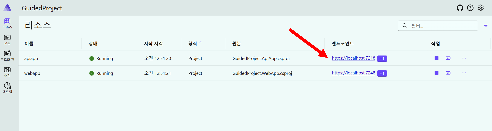
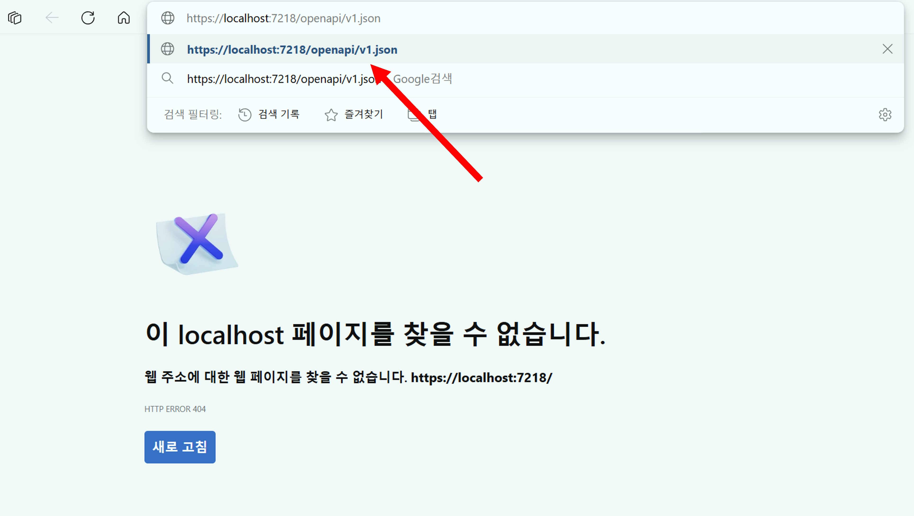
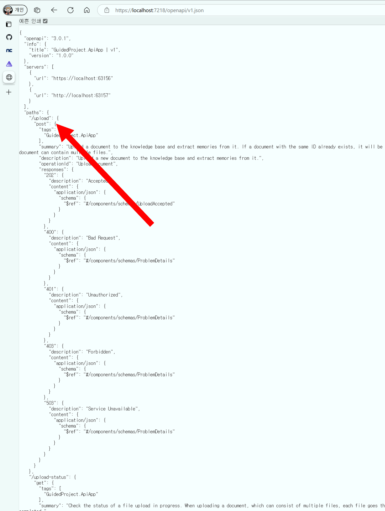
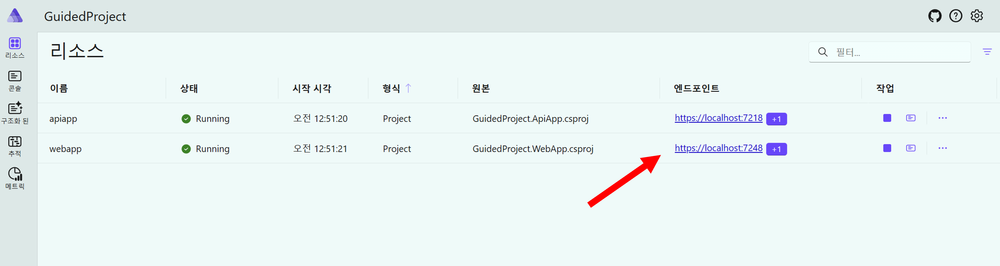
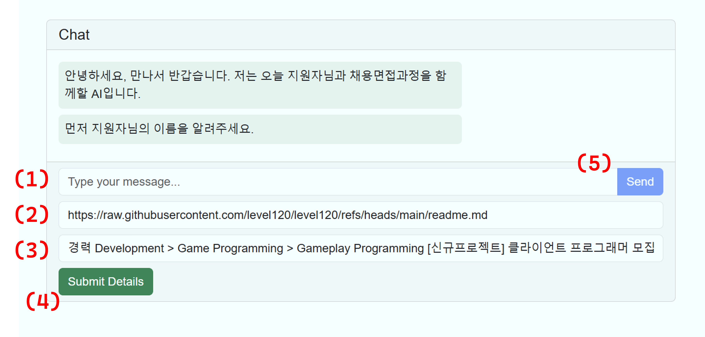
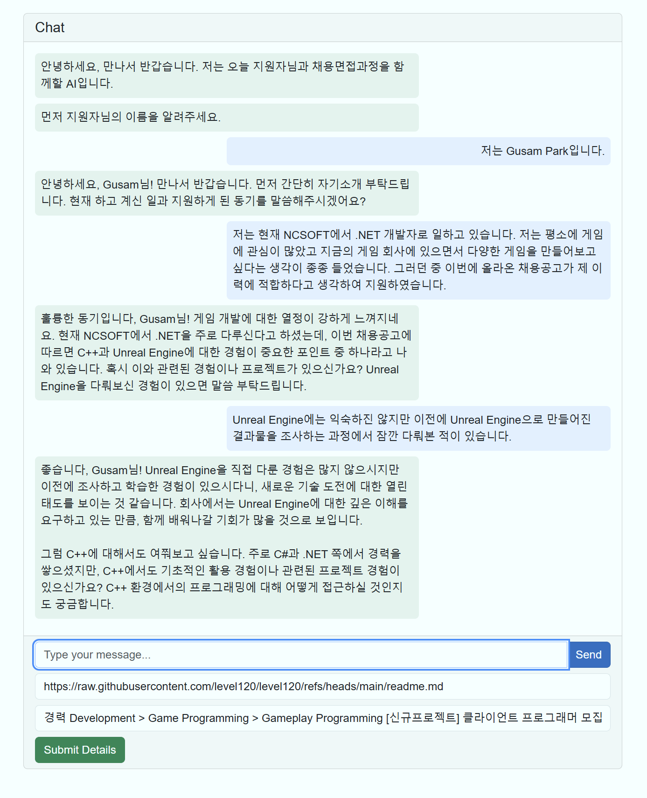

# EP10: 가이드 프로젝트 2

Semantic Kernel을 활용한 지능형 앱 개발하기 두번째 가이드 프로젝트입니다.

- ✅ Blazor 프론트엔드
- ✅ Semantic Kernel 백엔드
- ✅ RAG를 활용한 면접관 챗봇 만들기

- 🎙️ 진행: 박구삼
- 📜 자료: https://aka.ms/g3jlearnsk


## 시작하기

- 시작 프로젝트: `ep11/start`
- 완성 프로젝트: `ep11/complete`

### 리포지토리 루트 구하기

`REPOSITORY_ROOT` 변수를 선언합니다.

```bash
# bazh/zsh
REPOSITORY_ROOT=$(git rev-parse --show-toplevel)
```

```powershell
# PowerShell
$REPOSITORY_ROOT = git rev-parse --show-toplevel
```

### 시작 프로젝트 이동

1. 시작 프로젝트로 이동합니다.

    ```bash
    cd $REPOSITORY_ROOT/ep11/start
    ```

#### AppHost 프로젝트 수정

1. 이 세션에서는 Kernel Memory를 사용합니다. 해당 서비스를 이용하기 위해 user-secrets 위치에 다음 내용을 추가합니다.

    ```bash
    dotnet user-secrets --project ./GuidedProject.AppHost set "KernelMemory:Services:AzureOpenAIEmbedding:Endpoint" "{{YOUR_AZURE_OPENAI_ENDPOINT}}"
    dotnet user-secrets --project ./GuidedProject.AppHost set "KernelMemory:Services:AzureOpenAIEmbedding:APIKey" "{{YOUR_AZURE_OPENAI_APIKEY}}"
    dotnet user-secrets --project ./GuidedProject.AppHost set "KernelMemory:Services:AzureOpenAIEmbedding:Deployment" "{{YOUR_AZURE_OPENAI_DEPLOYMENT}}"
    dotnet user-secrets --project ./GuidedProject.AppHost set "KernelMemory:Services:AzureOpenAIText:Endpoint" "{{YOUR_AZURE_OPENAI_ENDPOINT}}"
    dotnet user-secrets --project ./GuidedProject.AppHost set "KernelMemory:Services:AzureOpenAIText:APIKey" "{{YOUR_AZURE_OPENAI_APIKEY}}"
    dotnet user-secrets --project ./GuidedProject.AppHost set "KernelMemory:Services:AzureOpenAIText:Deployment" "{{YOUR_AZURE_OPENAI_DEPLOYMENT}}"
    ```

1. 이전까지 앞에서 환경 설정을 모두 구성하였습니다만 이제는 더 이상 필요하지 않은 모델과 커넥션을 정리합니다.
1. 먼저 `GuidedProject.AppHost/Program.cs` 파일을 열어 다음 내용을 주석처리하거나 제거합니다.

    ```cs
    // 👇👇👇 여기 주석처리
    // var ollama = builder.AddOllama("ollama")
    //                     .WithImageTag("0.5.13")
    //                     .WithDataVolume()
    //                     // .WithContainerRuntimeArgs("--gpus=all")
    //                     .WithOpenWebUI()
    //                     .AddModel("phi4-mini");
    // var hface = builder.AddOllama("hface")
    //                    .WithImageTag("0.5.13")
    //                    .WithDataVolume()
    //                    // .WithContainerRuntimeArgs("--gpus=all")
    //                    .WithOpenWebUI()
    //                    .AddHuggingFaceModel("exaone", "LGAI-EXAONE/EXAONE-3.5-7.8B-Instruct-GGUF");
    ```

1. 이어서 다음 부분을 수정하여 Kernel Memory 정보를 등록합니다.

    ```cs
    var openai = builder.AddConnectionString("openai");

    var apiapp = builder.AddProject<GuidedProject_ApiApp>("apiapp")
                        .WithReference(openai)
                        // 👇👇👇 여기 주석처리
                        // .WithReference(ollama)
                        // .WithReference(hface)
                        .WithEnvironment("SemanticKernel__ServiceId", config["SemanticKernel:ServiceId"]!)
                        .WithEnvironment("GitHub__Models__ModelId", config["GitHub:Models:ModelId"]!)
                        // 👇👇👇 여기 주석처리
                        // .WaitFor(ollama)
                        // .WaitFor(hface)
                        // 👇👇👇 여기서부터 맨 아래까지 추가
                        // Global KM settings
                        .WithEnvironment("KernelMemory__TextGeneratorType", "AzureOpenAIText")
                        .WithEnvironment("KernelMemory__DataIngestion__EmbeddingGeneratorTypes__0", "AzureOpenAIEmbedding")
                        .WithEnvironment("KernelMemory__DataIngestion__MemoryDbTypes__0", "SimpleVectorDb")
                        .WithEnvironment("KernelMemory__Retrieval__EmbeddingGeneratorType", "AzureOpenAIEmbedding")
                        .WithEnvironment("KernelMemory__Retrieval__MemoryDbType", "SimpleVectorDb")
                        // SimpleVectorDb settings
                        .WithEnvironment("KernelMemory__Services__SimpleVectorDb__StorageType", "Volatile")
                        .WithEnvironment("KernelMemory__Services__SimpleVectorDb__Directory", "_vectors")
                        // Azure OpenAI settings - Text generation
                        .WithEnvironment("KernelMemory__Services__AzureOpenAIText__Auth", "1")
                        .WithEnvironment("KernelMemory__Services__AzureOpenAIText__APIKey", config["KernelMemory:Services:AzureOpenAIText:APIKey"])
                        .WithEnvironment("KernelMemory__Services__AzureOpenAIText__Endpoint", config["KernelMemory:Services:AzureOpenAIText:Endpoint"])
                        .WithEnvironment("KernelMemory__Services__AzureOpenAIText__Deployment", config["KernelMemory:Services:AzureOpenAIText:Deployment"])
                        // Azure OpenAI settings - Embeddings
                        .WithEnvironment("KernelMemory__Services__AzureOpenAIEmbedding__Auth", "1")
                        .WithEnvironment("KernelMemory__Services__AzureOpenAIEmbedding__APIKey", config["KernelMemory:Services:AzureOpenAIEmbedding:APIKey"])
                        .WithEnvironment("KernelMemory__Services__AzureOpenAIEmbedding__Endpoint", config["KernelMemory:Services:AzureOpenAIEmbedding:Endpoint"])
                        .WithEnvironment("KernelMemory__Services__AzureOpenAIEmbedding__Deployment", config["KernelMemory:Services:AzureOpenAIEmbedding:Deployment"]);
    ```

#### ApiApp 프로젝트 수정

1. Kernel Memory에서 제공하는 웹 서비스용 API를 사용하기 위해 아래와 같이 NuGet 패키지를 `GuidedProject.ApiApp`에 추가합니다.

    ```bash
    dotnet add ./GuidedProject.ApiApp package Microsoft.KernelMemory.Service.AspNetCore
    ```

1. `GuidedProject.ApiApp/Program.cs` 파일을 열고 커널 메모리 사용을 위한 설정파일 소스 구문을 추가합니다.

    ```cs
    var builder = WebApplication.CreateBuilder(args);

    // Add services to the container.
    builder.AddServiceDefaults();

    // 👇👇👇 여기 추가
    builder.Configuration.AddKernelMemoryConfigurationSources();
    ```

1. 이어서 커널 메모리 구성과 인스턴스를 등록합니다.

    ```cs
    builder.Services.AddScoped<IKernelService, KernelService>();

    // 👇👇👇 여기 추가
    KernelMemoryConfig config = builder.Configuration.GetSection("KernelMemory").Get<KernelMemoryConfig>();

    // 👇👇👇 여기 추가
    builder.AddKernelMemory(x =>
    {
        x.ConfigureDependencies(builder.Configuration);

        foreach (KeyValuePair<string, HandlerConfig> handlerConfig in config.Service.Handlers)
        {
            builder.Services.AddHandlerAsHostedService(config: handlerConfig.Value, stepName: handlerConfig.Key);
        }
    });
    ```

1. 이어서 AppHost에서 제외한 내용을 여기서도 제외합니다.

    ```cs
    builder.AddAzureOpenAIClient("openai");
    // 👇👇👇 여기 주석처리
    // builder.AddKeyedOllamaApiClient("ollama-phi4-mini");
    // builder.AddKeyedOllamaApiClient("exaone");

    builder.Services.AddSingleton<Kernel>(sp =>
    {
        var config = builder.Configuration;

        var openAIClient = sp.GetRequiredService<OpenAIClient>();
    // 👇👇👇 여기 주석처리
        // var ollamaClient = sp.GetRequiredKeyedService<IOllamaApiClient>("ollama-phi4-mini");
        // var hfaceClient = sp.GetRequiredKeyedService<IOllamaApiClient>("exaone");

        var kernel = Kernel.CreateBuilder()
                           .AddOpenAIChatCompletion(
                               modelId: config["GitHub:Models:ModelId"]!,
                               openAIClient: openAIClient,
                               serviceId: "github")
                           // 👇👇👇 여기 주석처리
                           // .AddOllamaChatCompletion(
                           //     ollamaClient: (OllamaApiClient)ollamaClient,
                           //     serviceId: "ollama")
                           // .AddOllamaChatCompletion(
                           //     ollamaClient: (OllamaApiClient)hfaceClient,
                           //     serviceId: "hface")
                           .Build();

        return kernel;
    });
    ```

1. 이어서 커널 메모리의 엔드포인트 구성을 등록합니다.

    ```cs
    // Configure the HTTP request pipeline.
    if (app.Environment.IsDevelopment())
    {
        app.MapOpenApi();
    }

    // 👇👇👇 여기 추가
    app.AddKernelMemoryEndpoints(kmConfig: config);

    app.UseHttpsRedirection();
    ```

1. `GuidedProject.ApiApp/Services/KernelService.cs` 파일을 열고 `CompleteChatStreamingAsync` 함수 내용 변경합니다.

    ```cs
    public async IAsyncEnumerable<string> CompleteChatStreamingAsync(IEnumerable<ChatMessageContent> messages)
    {
        // 👇👇👇 여기 추가
        // Chat setup
        var systemPrompt = """
                               당신은 채용면접관이 되어 지원자의 이력서와 채용공고를 보고 가장 적절한 질문을 합니다.
                               처음에는 분위기를 풀어주는 질문을 하고 점점 채용공고에 있는 기술과 지원자의 이력서에 있는 기술에 대해    질문을 합니다.
                               지원자의 대답을 듣고 적절한 피드백을 주세요.
                               그리고 계속해서 다음 질문을 이어가세요.

                               지원자의 이력서는 Kernel Memory의 ID가 Resume이고 채용공고는 Apply이라는 ID를 가지고 있습니다.
                               """;

        var history = new ChatHistory();
        history.AddRange(messages);

        var service = kernel.GetRequiredService<IChatCompletionService>(config["SemanticKernel:ServiceId"]!);

        // 👇👇👇 여기 추가
        var query = $"{systemPrompt}\n{messages.LastOrDefault(x => !string.IsNullOrWhiteSpace(x.Content))?.Content}";

        // 👇👇👇 여기 추가
        var longTermMemory = await GetLongTermMemory(kernelMemory, query);

        // 👇👇👇 여기 추가
        // Inject the memory recall in the initial system message
        history[0].Content = $"{systemPrompt}\n\nLong term memory:\n{longTermMemory}";

        // 👇👇👇 여기 수정
        var result = service.GetStreamingChatMessageContentsAsync(chatHistory: history, kernel: kernel);
        await foreach (var text in result)
        {
            yield return text.ToString();
        }
    }

    // 👇👇👇 여기 함수 전체 추가
    private static async Task<string> GetLongTermMemory(IKernelMemory memory, string query, bool asChunks = true)
    {
        if (asChunks)
        {
            // Fetch raw chunks, using KM indexes. More tokens to process with the chat history, but only one LLM request.
            SearchResult memories = await memory.SearchAsync(query, limit: 10);
            return memories.Results.SelectMany(m => m.Partitions).Aggregate("", (sum, chunk) => sum + chunk.Text + "\n").Trim();
        }

        // Use KM to generate an answer. Fewer tokens, but one extra LLM request.
        MemoryAnswer answer = await memory.AskAsync(query);
        return answer.Result.Trim();
    }
    ```


#### 앱 실행

1. 아래 명령어를 실행시켜 .NET Aspire 대시보드 앱을 실행시킵니다.

    ```bash
    dotnet watch run --project ./GuidedProject.AppHost
    ```

1. 대시보드가 보이면 `apiapp`의 엔드포인트를 클릭합니다.

   

1. 지금은 페이지를 찾을 수 없다고 나올 것입니다. 주소창 클릭 후 `/openapi/v1.json` 추가 후 이동합니다.

   

1. OpenAPI 스펙 문서가 보이면 `paths` 아래 `/upload` 등이 보이는지 확인합니다. 이는 우리가 조금 전 커널 메모리 엔드포인트를 구성했기에 자동으로 추가되는 엔드포인드입니다.

   

1. 모두 확인했다면 CTRL+C 키를 눌러 애플리케이션을 종료합니다.

#### WebApp 프로젝트 수정

1. Kernel Memory에서 제공하는 웹 클라이언트용 API를 사용하기 위해 아래와 같이 NuGet 패키지를 `GuidedProject.WebApp`에 추가합니다.

    ```bash
    dotnet add ./GuidedProject.WebApp package Microsoft.KernelMemory.WebClient
    ```

1. `GuidedProject.WebApp/Program.cs` 파일을 열고 커널 메모리 사용을 위한 설정파일 소스 구문을 추가합니다. 만약 HTTP로 구성한다면 환경변수를 `services__apiapp__https__0` 대신 `services__apiapp__http__0`로 사용합니다.

    ```cs
    builder.Services.AddRazorComponents()
                    .AddInteractiveServerComponents();

    // 👇👇👇 여기 추가
    builder.Services.AddSingleton<MemoryWebClient>(new MemoryWebClient(Environment.GetEnvironmentVariable("services__apiapp__https__0")));
    ```

1. `GuidedProject.WebApp/ApiClients/ChatClient.cs` 파일을 열고 `IChatClient` 인터페이스에 새로운 함수를 추가합니다.

    ```cs
    public interface IChatClient
    {
        IAsyncEnumerable<string> CompleteChatStreamingAsync(string prompt);
        IAsyncEnumerable<string> CompleteChatStreamingWithHistoryAsync(IEnumerable<ChatMessage> messages);

        // 👇👇👇 여기 추가
        Task<string> UpdateMemoryFromWeb(string key, string uri);
        // 👇👇👇 여기 추가
        Task<string> UpdateMemoryFromText(string key, string text);
    }
    ```

1. 이어서 `ChatClient`에 `MemoryWebClient`를 받도록 수정합니다.

    ```cs
                                            // 👇👇👇 여기 추가
    public class ChatClient(HttpClient http, MemoryWebClient memoryWebClient) : IChatClient
    ```


1. 이어서 `UpdateMemoryFromWeb`, `UpdateMemoryFromText` 함수를 구현합니다.

    ```cs
    // 👇👇👇 여기 함수 추가
    public async Task<string> UpdateMemoryFromWeb(string key, string uri)
    {
        var id = await memoryWebClient.ImportWebPageAsync(uri, key);

        while (!await memoryWebClient.IsDocumentReadyAsync(id))
        {
            await Task.Delay(TimeSpan.FromSeconds(1));
        }

        return id;
    }

    // 👇👇👇 여기 함수 추가
    public async Task<string> UpdateMemoryFromText(string key, string text)
    {
        var id = await memoryWebClient.ImportTextAsync(text, key);

        while (!await memoryWebClient.IsDocumentReadyAsync(id))
        {
            await Task.Delay(TimeSpan.FromSeconds(1));
        }

        return id;
    }
    ```

1. `GuidedProject.WebApp/Components/UI/ChatComponent.razor` 파일을 열고 이력서와 채용공고 내용을 받을 수 있는 텍스트 박스와 제출 버튼을 추가합니다.

    ```html
    <!-- Input Footer -->
    <div class="card-footer">
        <div class="input-group mb-2">
            <input class="form-control" placeholder="Type your message..." @bind="UserMessage" @bind:event="oninput" @onkeydown="OnKeyDownAsync" />
            <button class="btn btn-primary" @onclick="SendMessageAsync" disabled="@(IsReady ? null : true)">Send</button>
        </div>
        // 👇👇👇 여기 추가
        <div class="input-group mb-2">
            <input class="form-control" placeholder="Enter resume link..." @bind="ResumeLink" />
        </div>
        // 👇👇👇 여기 추가
        <div class="input-group mb-2">
            <input class="form-control" placeholder="Enter job posting..." @bind="JobPosting" />
        </div>
        // 👇👇👇 여기 추가
        <button class="btn btn-success" @onclick="SubmitDetailsAsync">Submit Details</button>
    </div>
    ```

1. 이어서 코드에 변수 바인딩을 받을 수 있도록 수정합니다.

    ```cs
    protected List<ChatMessage> Messages = new();
    protected string UserMessage = string.Empty;
    // 👇👇👇 여기 추가
    protected string ResumeLink = string.Empty;
    // 👇👇👇 여기 추가
    protected string JobPosting = string.Empty;
    // 👇👇👇 여기 추가
    protected bool IsReady = false;
    ```

1. 이어서 지원자가 당황하지 않도록 `OnInitializedAsync` 함수에 첫 메시지를 수정합니다.

    ```cs
    protected override async Task OnInitializedAsync()
    {
        // 👇👇👇 여기 추가
        this.Messages.Add(new ChatMessage("Assistant", "안녕하세요, 만나서 반갑습니다. 저는 오늘 지원자님과 채용면접과정을 함께할 AI입니다."));
        // 👇👇👇 여기 추가
        this.Messages.Add(new ChatMessage("Assistant", "먼저 지원자님의 이름을 알려주세요."));

        await Task.CompletedTask;
    }
    ```

1. 이어서 파일 맨 아래에 커널 메모리로 입력한 데이터를 벡터화 할 수 있게 `SubmitDetailsAsync` 함수를 생성합니다.

    ```cs
    // 👇👇👇 여기 함수 추가
    protected async Task SubmitDetailsAsync()
    {
        IsReady = false;

        // Handle the submission of ResumeLink and JobPosting
        if (!string.IsNullOrWhiteSpace(ResumeLink) && !string.IsNullOrWhiteSpace(JobPosting))
        {
            await Task.WhenAll(
                Chat.UpdateMemoryFromWeb("Resume", ResumeLink),
                Chat.UpdateMemoryFromText("Apply", JobPosting));
        }

        IsReady = true;
    }
    ```

#### 앱 실행

1. 아래 명령어를 실행시켜 .NET Aspire 대시보드 앱을 실행시킵니다.

    ```bash
    dotnet watch run --project ./GuidedProject.AppHost
    ```

1. 대시보드가 보이면 `webapp`의 엔드포인트를 클릭합니다.

   

1. 아래와 같은 화면을 만나면 다음 순서를 따라 설정합니다.

    1. `(1)`은 내가 질문에 답을 작성하는 공간입니다.
    1. `(2)`는 나의 이력서 문서 링크를 작성하는 공간입니다. 여기서는 GitHub 프로필에 연결된 Readme.md 파일을 걸었습니다.
    1. `(3)`은 채용 공고의 내용을 넣는 공간입니다. 여기서는 [N사의 게임 클라이언트 프로그래머 모집 공고](./images/06-careers.png)를 넣었습니다.
    1. `(4)`는 2와 3번 작성이 끝나고 이 데이터를 벡터화하는 작업을 시작하는 버튼입니다.
    1. `(5)`는 내가 질문에 답을 제출하는 버튼입니다.
    1. 따라서 `(2)` -> `(3)` -> `(4)` -> `(1)` -> `(5)` 순으로 진행합니다.

   

1. 다음 그림과 같은 동작이 이뤄지는지 확인합니다.

   

1. 답변을 확인한 후 CTRL+C 키를 눌러 애플리케이션을 종료합니다.
